# E-cology 9.0 Backend Development Environment Setup

**Author:** Weaver International Technical Delivery Team<br>
**Date:** 25-Dec-2020<br>
**Telephone:** +6569085816<br>
**Website:** www.weaver.com.sg<br>
**Email:** sales@weaver.com.sg<br>

## 1. Install idea and e-code
> Weaver suggest idea as the development IDE, please check www.jetbrains.com for more details.

1. Install idea follow the official installation guideline
2. Install latest e-code on e-cology environment

## 2. Create Project

1. Create a new project: File->New->Project


2. select java project

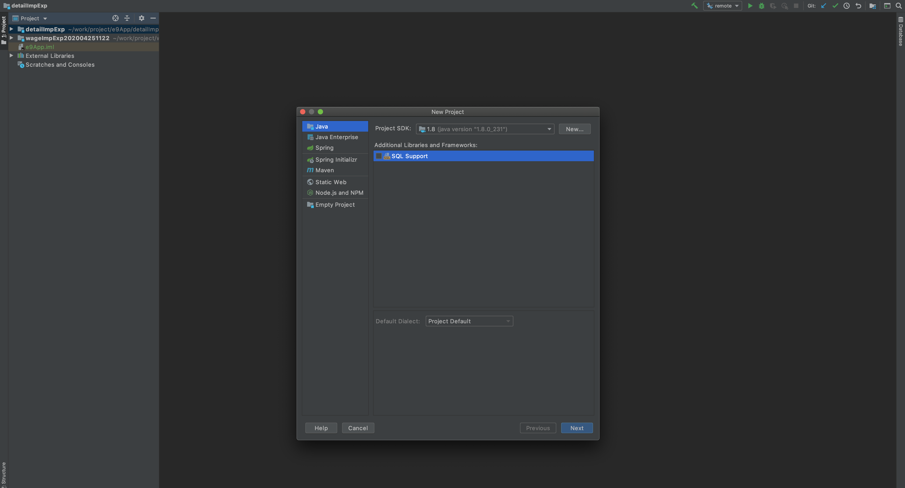

3. Click Next


4. Click Next, enter project name, and click finish

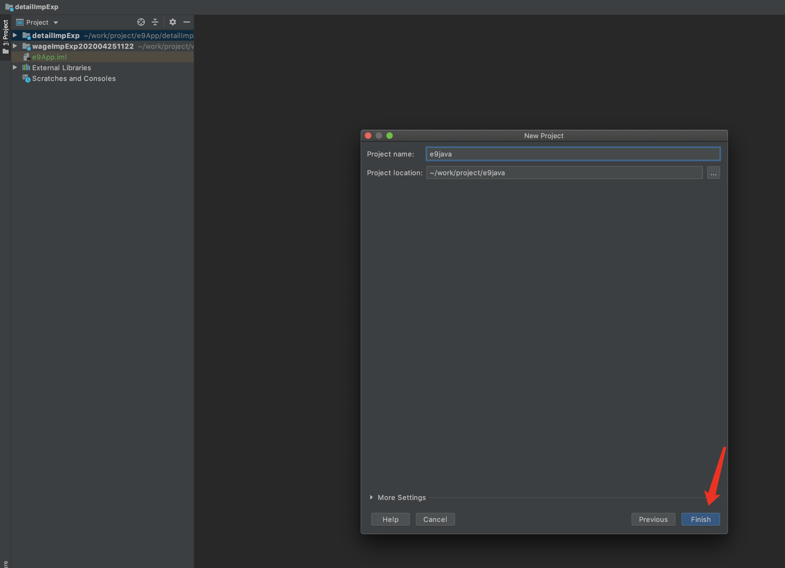

## 3. Configure the SDK

1. Go to project setting, File->Project Structure


2. Click SDK->+, to add JDK1.8 into project

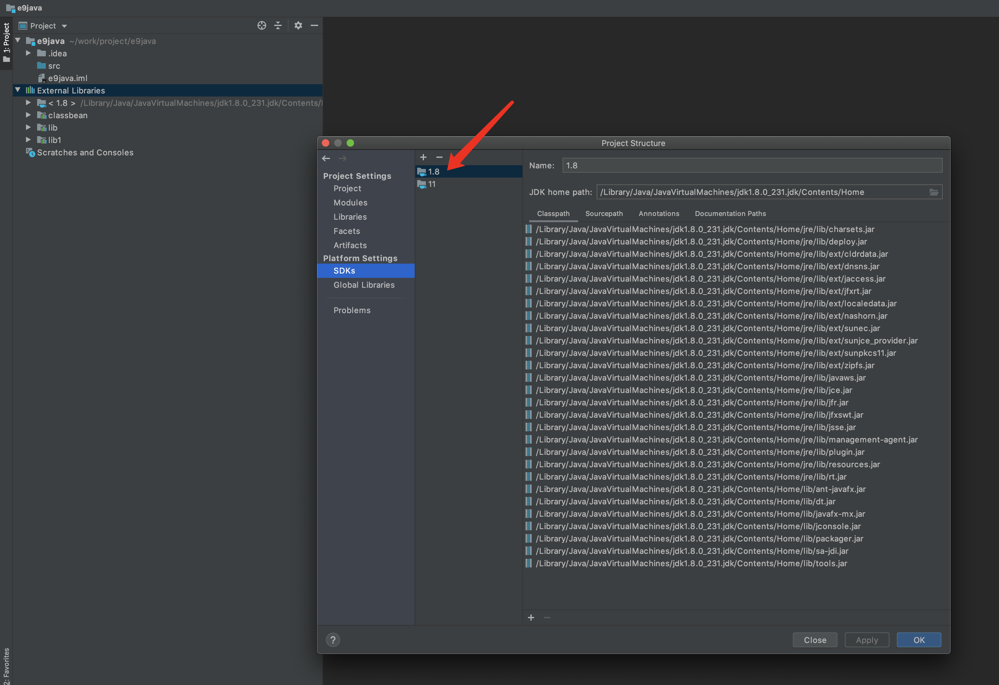

3. Click prject，set Project SDK as 1.8 and Project language level as SDK default 8

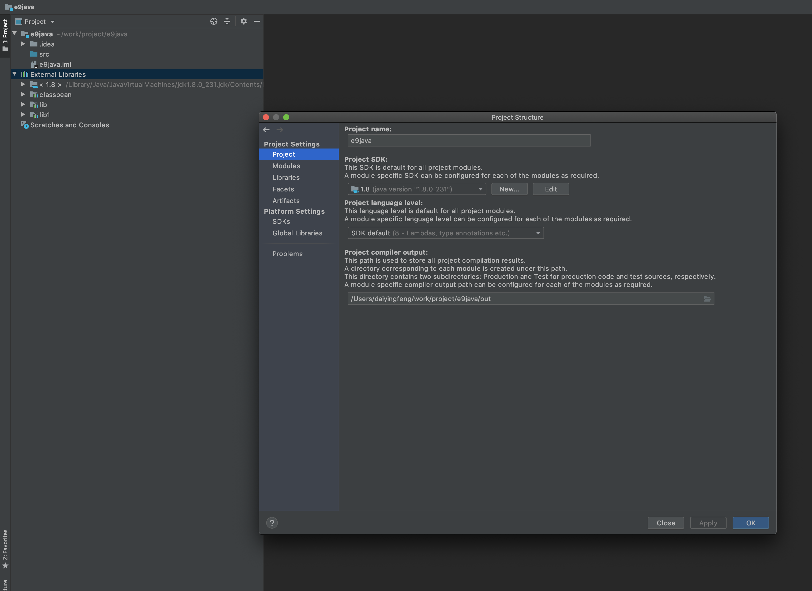

## 4. Configure project dependencies

1. Go to project setting：File->Project Structure


2. Add dependency library: Libaries->+->java 


3. Get your demo/testing e-cology environment, and import below file/folder path

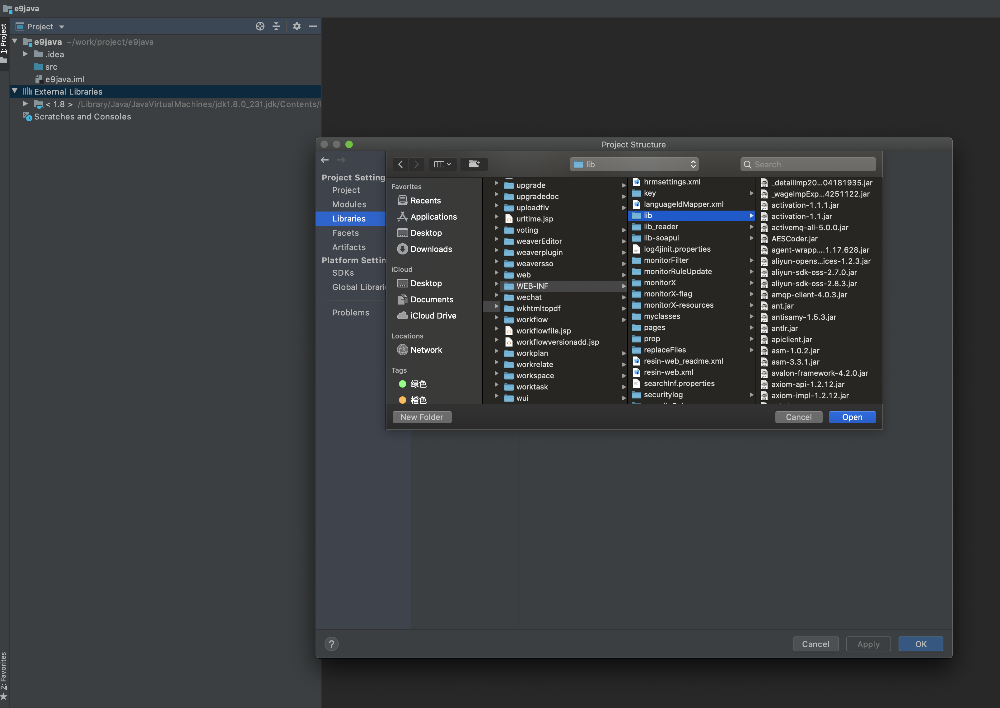

```
ecology/classbean
ecology/web-inf/lib
resin4/lib
```


4. After add all library and e-cology path, click apply.

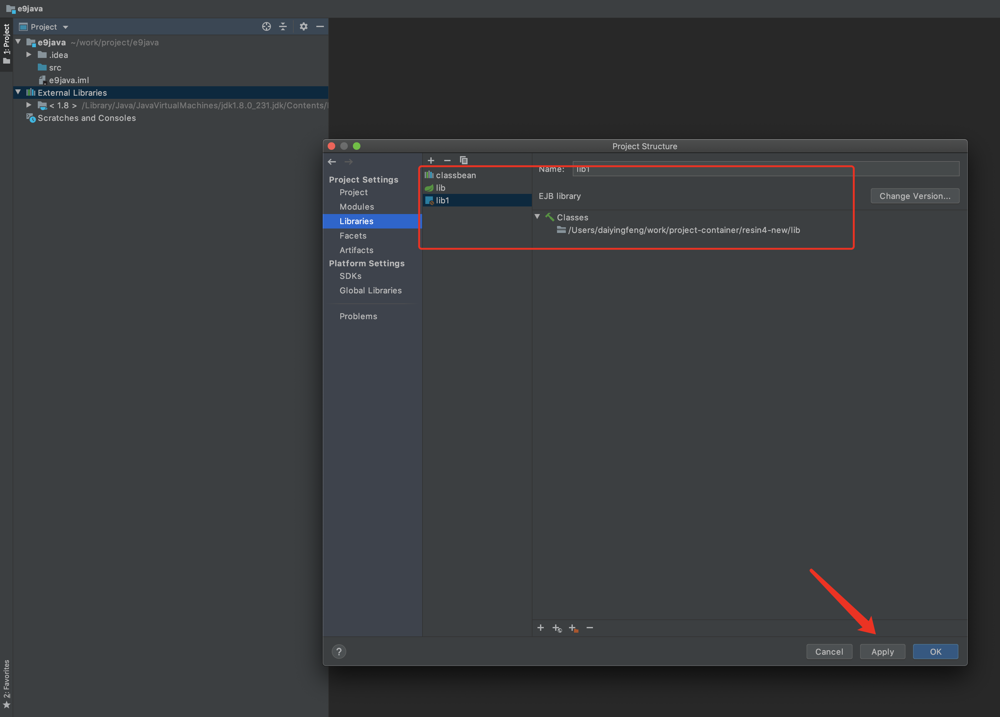

## 5. Write your testing code now

1. Right click SRC->New->Package

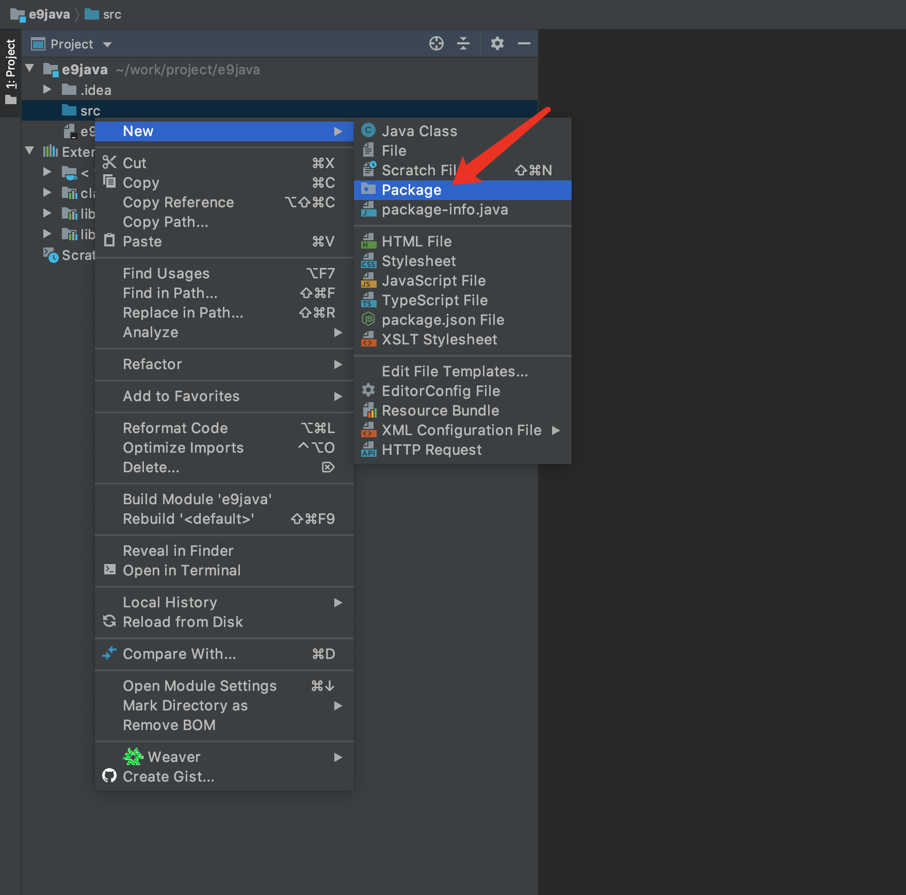

2. Right click package->new->Java, please note the package should include impl, then can support non-intrusive development

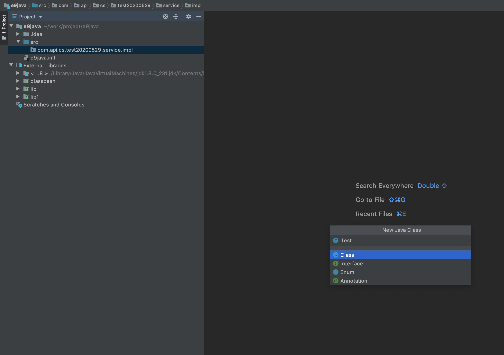

3. Testing Code

```java
package com.api.cs.test20200529.service.impl;
import com.weaverboot.frame.ioc.anno.classAnno.WeaIocReplaceComponent;
import com.weaverboot.frame.ioc.anno.methodAnno.WeaReplaceAfter;
import com.weaverboot.frame.ioc.anno.methodAnno.WeaReplaceBefore;
import com.weaverboot.frame.ioc.handler.replace.weaReplaceParam.impl.WeaAfterReplaceParam;
import com.weaverboot.frame.ioc.handler.replace.weaReplaceParam.impl.WeaBeforeReplaceParam;
import com.weaverboot.tools.logTools.LogTools;
@WeaIocReplaceComponent
public class Test {
    @WeaReplaceBefore(value = "/api/workflow/reqlist/splitPageKey",order = 1,description = "Test before interrupt")
    public void beforeTest(WeaBeforeReplaceParam weaBeforeReplaceParam){
        //Some code here
        LogTools.info("before:/api/workflow/reqlist/splitPageKey");
    }
    @WeaReplaceAfter(value = "/api/workflow/reqlist/splitPageKey",order = 1,description = "Test after interrupt")
    public String after(WeaAfterReplaceParam weaAfterReplaceParam){
        String data = weaAfterReplaceParam.getData();//This is the result after the action completed
        LogTools.info("after:/api/workflow/reqlist/splitPageKey");
//        LogTools.info(data);
        return data;
    }
}
```

## 6. Configuration compilation

1. Go to project setting: File->Project Structure


2. Go to Artifacts->+->JAR->Empty

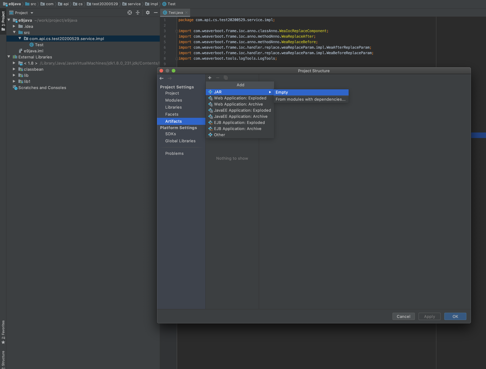

3. Edit Name, please note if the code need to support non-intrusive development, jar package name must contain an underscore prefix, similar to the example writing


4. Modify jar output directory as ecology/web-inf/lib

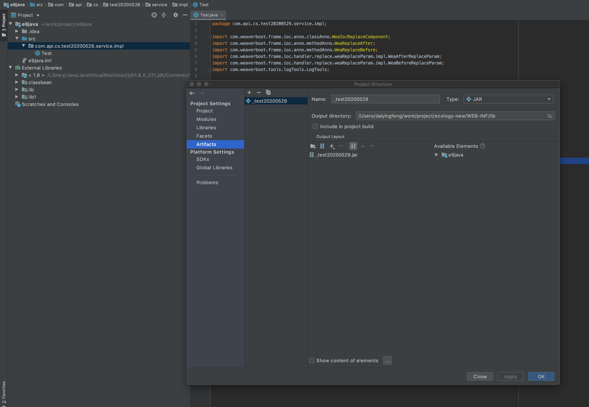

5. add src output to jar package and then click Apply


6. Select build->Build Artifacts 

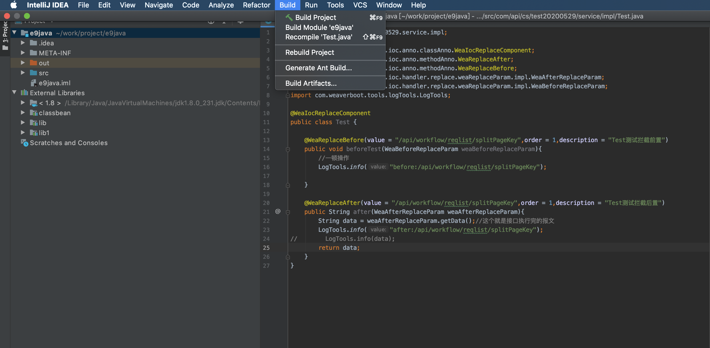

7. Click build, you could complete your build process 


8. Check build result in e-cology system

## 7. resin remote debug configuration

1. go to resin configuration file：resin4/config/resin.properties to edit jvm_args

```xml
jvm_args  : -Xdebug -Xrunjdwp:transport=dt_socket,address=9081,server=y,suspend=n -Dcom.sun.management.jmxremote -Xloggc:/var/log/gc.log -Xmx1550m -Xms1550m -XX:ParallelGCThreads=20 -XX:+UseConcMarkSweepGC -XX:+UseParNewGC -XX:+DisableExplicitGC
jvm_mode  : -server
```
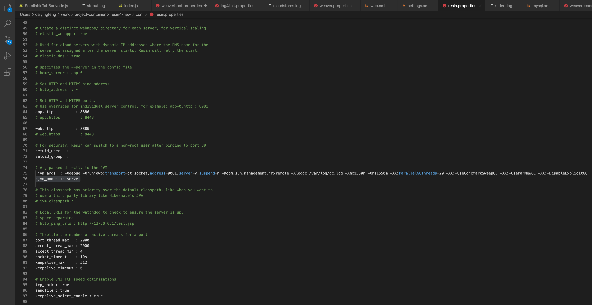

2. Add middleware connection

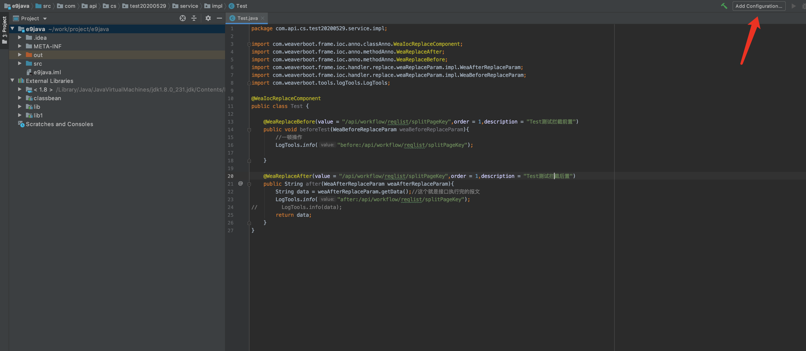

3. ADD +->Resin->Remote Service, input ec server address URL and remote resin debug port

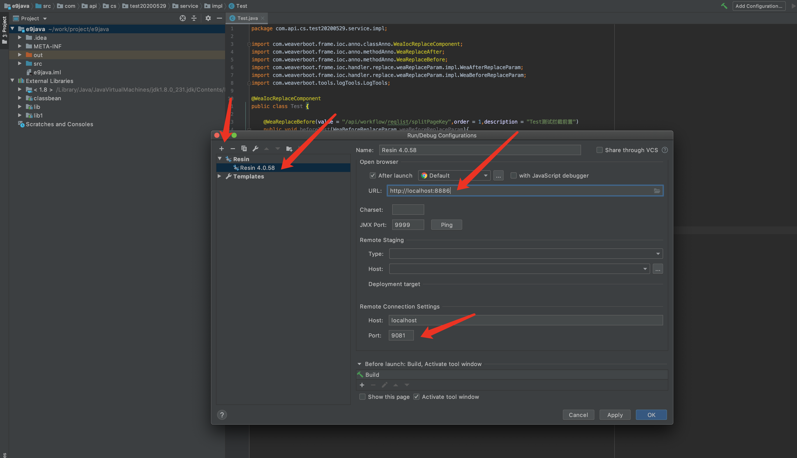

4. Select configure and select resin home


5. Add jar package 


6. Select pre-defined Artifacts, and click apply to save

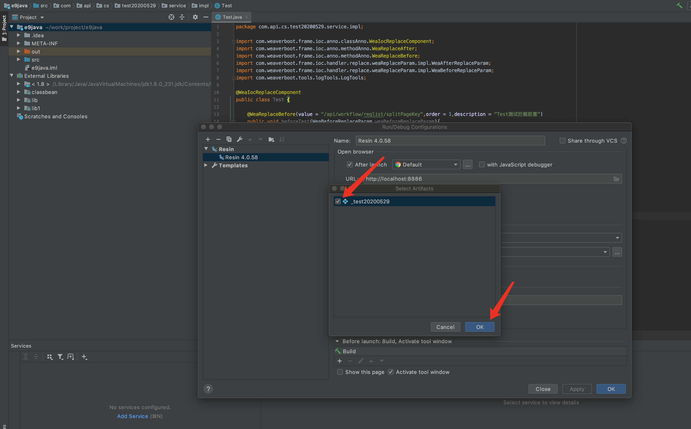

7. If in the same system, please select 


8. Switch Startup/Connection, modify Debug->port as resin remote debug port

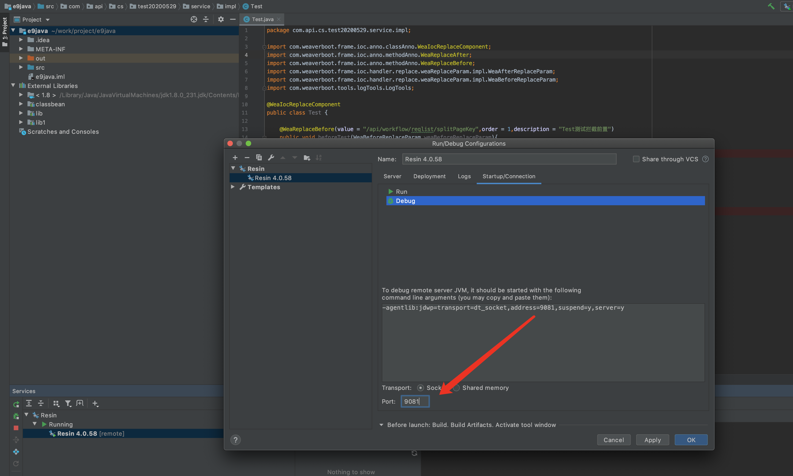

9. start debug in service 


10. Go to sepecial page to refresh, if breakpoint stop successfully, then debug configure is successfully

